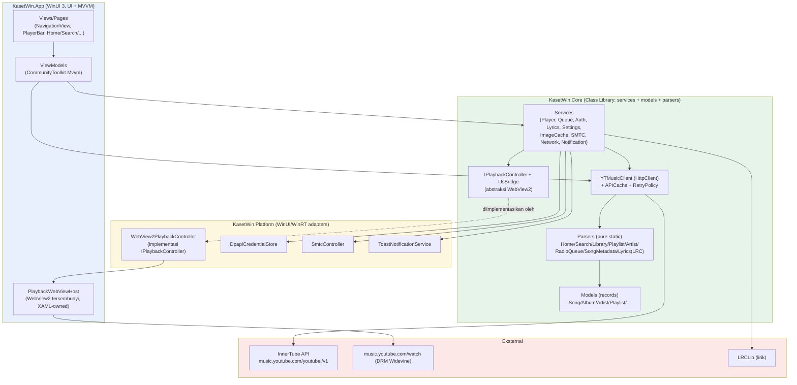
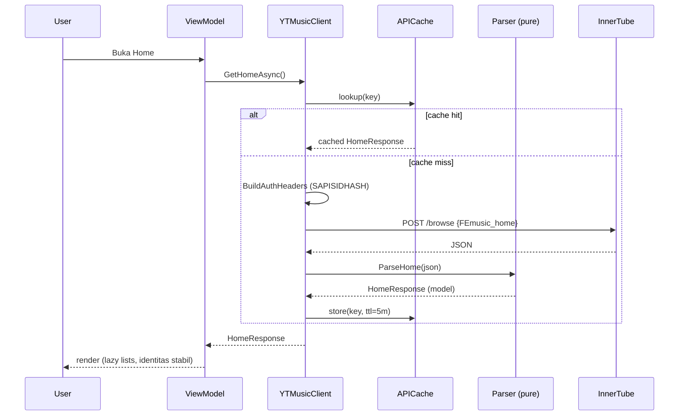
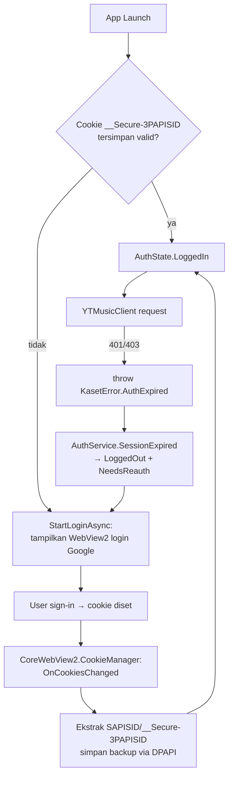
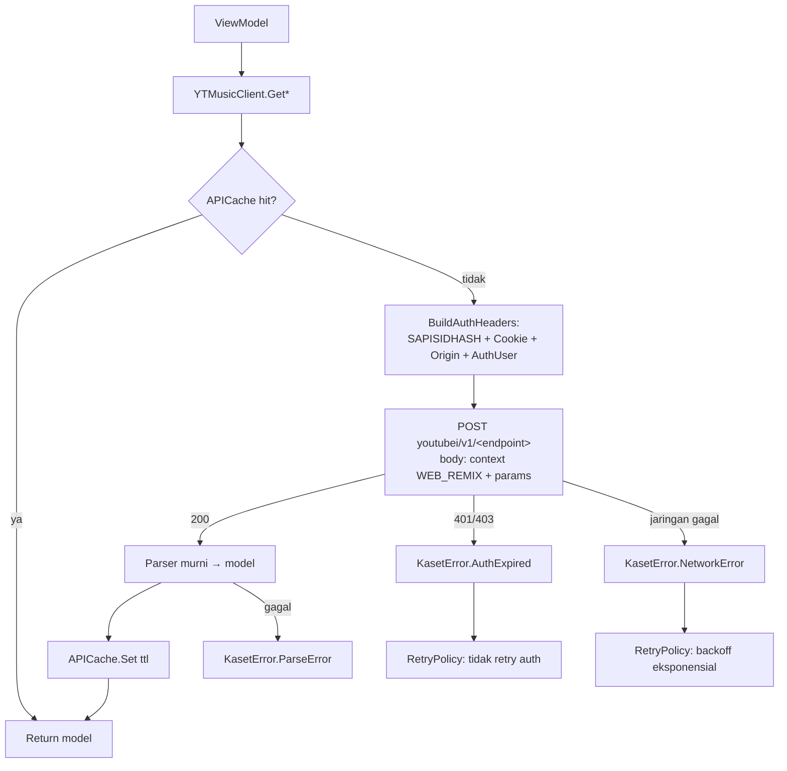
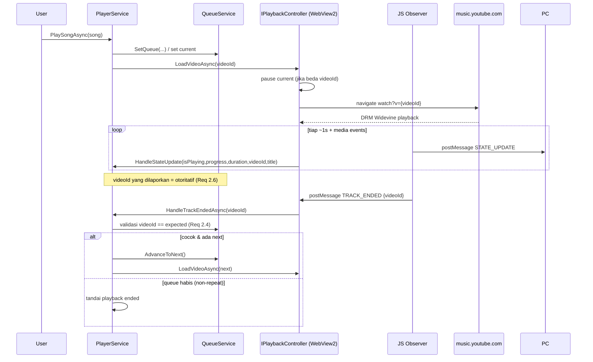
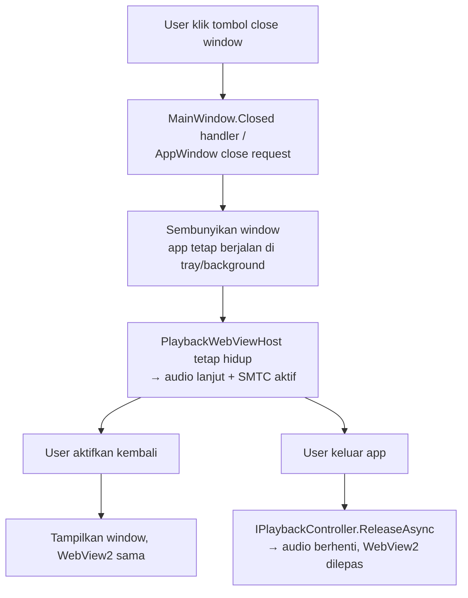

# Design Document — Kaset WinUI 3

## Overview

Dokumen ini merancang pembangunan ulang (port) aplikasi **Kaset** dari klien YouTube Music native macOS (Swift/SwiftUI) menjadi aplikasi **native Windows** menggunakan **WinUI 3 (C#/.NET 8)** dengan tampilan **Fluent Design** (Mica/Acrylic, `NavigationView`). Desain mempertahankan dua keputusan arsitektur yang menentukan kelayakan teknis dari versi macOS:

1. **Pemutaran ber-DRM (Widevine) melalui WebView tersembunyi** — di Windows menggunakan **WebView2 (Chromium/Evergreen)** yang memuat `music.youtube.com/watch?v={id}`.
2. **Arsitektur API-first** — seluruh pengambilan data melalui API internal InnerTube YouTube Music dengan autentikasi **SAPISIDHASH**, parser modular murni, dan WebView2 hanya untuk pemutaran + login.

### Prinsip Desain

- **Folder/solution baru yang terpisah.** Seluruh kode C# berada di solution .NET baru `KasetWin/`. Repo macOS Swift yang ada **hanya menjadi referensi** (logika parser, daftar endpoint, perilaku JS bridge, kuirk API) dan **tidak** menjadi tempat menaruh kode C#.
- **Pemisahan lapisan tegas.** UI (App) tidak pernah memanggil HTTP atau menyentuh WebView2 langsung; semua melalui service di Core. Parser adalah fungsi murni (pure static) tanpa I/O.
- **MVVM + Dependency Injection.** `CommunityToolkit.Mvvm` untuk ViewModel/observable, `Microsoft.Extensions.DependencyInjection` untuk komposisi service. Setiap service punya antarmuka (interface) agar dapat di-mock dalam pengujian.
- **Keamanan rahasia by-default.** Cookie/token/SAPISID tidak pernah masuk log, fixture, atau dokumentasi. Kredensial sensitif disimpan via DPAPI/Credential Locker.

### Pemetaan Keputusan Scope (dikonfirmasi user)

| Aspek macOS | Keputusan Windows | Catatan |
|-------------|-------------------|---------|
| Liquid Glass / `.glassEffect()` | Fluent native: Mica (window), Acrylic (flyout/sidebar), `NavigationView` | Look native Windows 11 |
| AI / Apple Intelligence (Command Bar, lirik AI, analisis antrian, refine playlist) | **Dihilangkan** | Di luar lingkup (Req 36.6) |
| Equalizer (Core Audio tap) | **Ditunda** | Tidak ada padanan langsung; future work (Req 36.1) |
| Haptic (Force Touch) | **Ditunda** | Tidak ada padanan native Windows (Req 36.2) |
| AppleScript | **Protocol activation `kaset://`** + argumen CLI | Fase lanjutan (Req 33, 36.4) |
| Sparkle auto-update | Windows update (MSIX/Velopack) | **Ditunda** (Req 36.5) |
| Keychain | **Credential Locker / DPAPI** | Inti (Req 22) |
| WKWebView | **WebView2** | Inti (Req 1–2) |
| Media keys + Now Playing (MPRemoteCommandCenter / MPNowPlayingInfoCenter) | **SMTC** (`SystemMediaTransportControls`) | Inti (Req 10) |
| `NWPathMonitor` | `Windows.Networking.Connectivity.NetworkInformation` | Fase lanjutan (Req 35) |
| `os.Logger` / `DiagnosticsLogger` | `Microsoft.Extensions.Logging` (+ Serilog sink) dengan redaksi | Inti (Req 21) |
| Local notifications | Windows toast (`AppNotificationManager`) | Fase lanjutan (Req 35) |

### Catatan Sumber

Desain ini di-*ground* pada dokumen referensi repo macOS: `docs/architecture.md` (struktur service, alur auth/request/playback/background, caching, retry), `docs/playback.md` (singleton WebView, observer script, queue authority, infinite mix), `docs/video.md` (floating video, deteksi OMV/ATV/UGC), `docs/youtube.md` (mode YouTube), dan `docs/api-discovery.md` (daftar endpoint, SAPISIDHASH, brand account, MPSPP→P, filter params base64). Tidak ada nilai kredensial nyata yang dikutip dari sumber manapun.

---

## Architecture

### Tampilan Lapisan (Layered View)



**Aturan ketergantungan:** `App` → `Core` dan `Platform`; `Platform` → `Core`; `Core` tidak bergantung pada `App` maupun WinUI. Parser dan Models tidak punya dependensi keluar (pure). Ini memungkinkan `Core` diuji tanpa WinUI runtime dan tooling CLI (API Explorer) memakai ulang `Core` apa adanya.

### Data Flow Ringkas



### Komposisi & Bootstrapping

`App.xaml.cs` membangun `IHost` (Generic Host) saat startup dan mendaftarkan seluruh service ke kontainer DI. ViewModel di-*resolve* dari kontainer (constructor injection). Service singleton (Player, Queue, Auth, WebView2 controller, SMTC) hidup selama umur aplikasi.

```csharp
// KasetWin.App/App.xaml.cs (ringkas)
private static IHost BuildHost() =>
    Host.CreateDefaultBuilder()
        .ConfigureServices((ctx, services) =>
        {
            // Core
            services.AddSingleton<IApiCache, ApiCache>();
            services.AddSingleton<IRetryPolicy, ExponentialBackoffRetryPolicy>();
            services.AddSingleton<ICredentialStore, DpapiCredentialStore>();
            services.AddSingleton<ICookieSource, WebView2CookieSource>();
            services.AddSingleton<IYTMusicClient, YTMusicClient>();
            services.AddSingleton<IAuthService, AuthService>();
            services.AddSingleton<IQueueService, QueueService>();
            services.AddSingleton<IPlayerService, PlayerService>();
            services.AddSingleton<ISettingsService, SettingsService>();
            services.AddSingleton<IImageCache, ImageCache>();
            services.AddSingleton<ILyricsService, LyricsService>();

            // Platform (WinUI/WinRT)
            services.AddSingleton<IPlaybackController, WebView2PlaybackController>();
            services.AddSingleton<INowPlayingController, SmtcController>();
            services.AddSingleton<INetworkMonitor, NetworkMonitor>();
            services.AddSingleton<INotificationService, ToastNotificationService>();

            // ViewModels (transient)
            services.AddTransient<HomeViewModel>();
            services.AddTransient<SearchViewModel>();
            // ...
            services.AddLogging(b => b.AddSerilog(BuildLogger()));
        })
        .Build();
```

---

## Struktur Proyek / Solution Baru (folder terpisah)

Solution baru dibuat di **`KasetWin/`** pada root workspace (sejajar dengan `Sources/` macOS, bukan di dalamnya). Repo Swift tetap utuh sebagai referensi.

```
KasetWin/                              ← solution .NET BARU (terpisah dari kode Swift)
├── KasetWin.sln
├── Directory.Build.props              ← nullable enable, LangVersion, analyzers
├── src/
│   ├── KasetWin.App/                  ← WinUI 3 (UI, MVVM, XAML, packaging MSIX)
│   │   ├── App.xaml(.cs)              ← Generic Host + DI bootstrap
│   │   ├── MainWindow.xaml(.cs)       ← Mica, NavigationView + Frame, PlayerBar
│   │   ├── Views/                     ← Home/Explore/Search/Library/Playlist/Album/
│   │   │                                Artist/Queue/Lyrics/Settings + LoginDialog
│   │   ├── ViewModels/                ← *ViewModel : ObservableObject
│   │   ├── Controls/                  ← PlayerBar, SongRow, MediaCard, dst.
│   │   ├── Hosting/                   ← PlaybackWebViewHost (WebView2 tersembunyi)
│   │   ├── Converters/ Selectors/
│   │   ├── Strings/                   ← .resw per bahasa (en/fr/ko/id/tr/ar) + RTL
│   │   └── Package.appxmanifest       ← protocol kaset://, kapabilitas
│   ├── KasetWin.Core/                 ← Class library (NO WinUI dependency)
│   │   ├── Models/                    ← record/class data (Song, Album, ...)
│   │   ├── Services/
│   │   │   ├── Api/                   ← YTMusicClient, ApiCache, RetryPolicy, InnerTube
│   │   │   │   └── Parsers/           ← parser modular murni (static)
│   │   │   ├── Auth/                  ← AuthService (state machine)
│   │   │   ├── Player/                ← PlayerService, QueueService, WebQueueSync
│   │   │   ├── Lyrics/                ← LyricsService, LrcParser, LRCLibProvider
│   │   │   ├── Library/               ← reconciler, mutation actions
│   │   │   └── Settings/ ImageCache/ Network/
│   │   ├── Abstractions/              ← interface lintas-lapisan (IPlaybackController,
│   │   │                                IJsBridge, ICookieSource, ICredentialStore, ...)
│   │   └── Diagnostics/               ← logging kategori + redaksi
│   ├── KasetWin.Platform/             ← adapter WinUI/WinRT untuk abstraksi Core
│   │   ├── Playback/WebView2PlaybackController.cs
│   │   ├── Playback/Scripts/          ← observer.js, audioQuality.js (resource)
│   │   ├── Auth/WebView2CookieSource.cs
│   │   ├── Security/DpapiCredentialStore.cs
│   │   ├── Smtc/SmtcController.cs
│   │   ├── Network/NetworkMonitor.cs
│   │   └── Notifications/ToastNotificationService.cs
│   └── KasetWin.ApiExplorer/          ← tool CLI (Req 24): console app, referensi Core
│       └── Program.cs                 ← perintah: auth | list | browse <id> [-v] [--brand]
└── tests/
    ├── KasetWin.Core.Tests/           ← unit + property tests (xUnit + FsCheck/CsCheck)
    │   └── Fixtures/                   ← JSON InnerTube ter-sanitasi (padanan Tests/Fixtures)
    └── KasetWin.Core.Tests.Properties/← (opsional pemisahan property tests)
```

### Keputusan: kenapa tiga proyek (App/Core/Platform)?

Versi macOS menaruh service di dalam target app tunggal. Di Windows, memisahkan **Core** (tanpa WinUI) dari **Platform** (adapter WinRT) memberi tiga manfaat konkret:

1. **Testability** — `KasetWin.Core.Tests` mereferensikan `Core` saja dan berjalan di runner .NET biasa tanpa harus memuat WinUI/WinRT. Parser dan logika queue/auth diuji headless.
2. **Reuse oleh CLI** — `KasetWin.ApiExplorer` (Req 24) memakai `YTMusicClient` + parser identik yang dipakai aplikasi, sehingga eksplorasi endpoint memverifikasi kode produksi (sejalan aturan repo "Improve API Explorer, don't write one-off scripts").
3. **Inversi dependensi WebView2/SMTC** — `Core` mendefinisikan `IPlaybackController`/`INowPlayingController`; implementasi WinRT tinggal di `Platform`. `PlayerService` (Core) tidak tahu WebView2, sehingga state pemutaran dapat diuji dengan controller palsu (fake).

---

## Components and Interfaces

Bagian ini mendaftar antarmuka kunci (signatur C#). Tipe `Result`-style memakai exception `KasetError` (lihat Penanganan Error). Seluruh API async memakai `Task`/`ValueTask` dan `CancellationToken`.

### Abstraksi pemutaran (jembatan WebView2)

```csharp
namespace KasetWin.Core.Abstractions;

public enum PlaybackDisplayMode { Hidden, MiniPlayer, Video }

public interface IPlaybackController
{
    bool IsDrmAvailable { get; }                 // Req 1.7: deteksi Widevine
    string? CurrentVideoId { get; }
    Task EnsureInitializedAsync();               // buat singleton WebView2 sekali (Req 1.1)
    Task LoadVideoAsync(string videoId);         // pause-before-load (Req 1.2, 1.6)
    Task PlayAsync();
    Task PauseAsync();
    Task SeekAsync(double positionSeconds);      // dinonaktifkan saat live (Req 9.2)
    Task SetVolumeAsync(int volume0to100);
    Task SetMutedAsync(bool muted);
    Task SetAudioQualityAsync(AudioQuality quality); // Req 7
    Task SetDisplayModeAsync(PlaybackDisplayMode mode); // Hidden/Mini/Video (Req 26)
    Task ReleaseAsync();                         // saat quit (Req 1.5)
}

// Pesan dari JS observer → native (Req 2)
public interface IJsBridge
{
    event EventHandler<PlaybackStateMessage> StateUpdated;   // STATE_UPDATE
    event EventHandler<TrackEndedMessage> TrackEnded;        // TRACK_ENDED
}

public sealed record PlaybackStateMessage(
    bool IsPlaying, double Progress, double Duration,
    string VideoId, string Title, string Artist,
    bool TrackChanged, bool? HasVideo, MusicVideoType? VideoType);

public sealed record TrackEndedMessage(string VideoId);
```

### PlayerService & QueueService (Core, observable)

```csharp
public interface IPlayerService : INotifyPropertyChanged
{
    Song? CurrentTrack { get; }
    bool IsPlaying { get; }
    double Progress { get; }      // detik
    double Duration { get; }      // detik
    int Volume { get; }           // 0..100
    bool IsMuted { get; }
    bool IsLive { get; }          // Req 9
    RepeatMode RepeatMode { get; }
    bool IsShuffled { get; }

    Task PlayAsync(string videoId);
    Task PlaySongAsync(Song song);
    Task PlayCollectionAsync(IReadOnlyList<Song> songs, int startIndex = 0); // album/playlist/artist (Req 8)
    Task TogglePlayPauseAsync();          // Req 5.1
    Task NextAsync();                     // Req 5.2
    Task PreviousAsync();                 // Req 5.3
    Task SeekAsync(double seconds);       // Req 5.4
    void SetVolume(int volume);           // Req 5.5
    void ToggleMute();                    // Req 5.6
    void ToggleShuffle();                 // Req 5.7
    void CycleRepeat();                   // Req 5.8

    // Dipanggil dari IJsBridge (queue authority — Req 2.4/2.5/2.6)
    Task HandleTrackEndedAsync(string? observedVideoId);
    void HandleStateUpdate(PlaybackStateMessage message);
}

public interface IQueueService : INotifyPropertyChanged
{
    IReadOnlyList<Song> Tracks { get; }
    int CurrentIndex { get; }
    Song? CurrentTrack { get; }

    void SetQueue(IReadOnlyList<Song> songs, int startIndex = 0); // Req 6.5/8
    void Move(int fromIndex, int toIndex);     // Req 6.2
    void Clear();                              // Req 6.3
    void Shuffle();                            // Req 6.4 (jaga current track)
    void SetRepeatMode(RepeatMode mode);
    Song? PeekNext();                          // source of truth (Req 2.5)
    Song? AdvanceToNext();
    Song? AdvanceToPrevious();
    int AppendDeduplicated(IEnumerable<Song> songs); // infinite mix (Req 25.3)
}

public enum RepeatMode { Off, All, One }
public enum AudioQuality { Low, Medium, High }
```

### AuthService (state machine)

```csharp
public enum AuthState { LoggedOut, LoggingIn, LoggedIn }

public interface IAuthService : INotifyPropertyChanged
{
    AuthState State { get; }
    bool NeedsReauth { get; }
    string? ActiveAuthUserIndex { get; }   // X-Goog-AuthUser
    string? OnBehalfOfUser { get; }         // brand account (Req brand)

    Task CheckLoginStatusAsync();   // Req 4.6: cek cookie tersimpan saat launch
    Task StartLoginAsync();          // Req 4.2: tampilkan WebView2 login Google
    void OnCookiesChanged();         // Req 4.4: evaluasi ulang
    void SessionExpired();           // Req 4.5: dari authExpired → LoggedOut + re-auth
    Task SwitchAccountAsync(string authUserIndex, string? brandId); // multi-account
}
```

### YTMusicClient (HttpClient)

```csharp
public interface IYTMusicClient
{
    // Browse (Inti)
    Task<HomeResponse> GetHomeAsync(CancellationToken ct = default);                 // FEmusic_home (Req 11)
    Task<HomeResponse> GetHomeContinuationAsync(string token, CancellationToken ct = default); // Req 11.2
    Task<HomeResponse> GetExploreAsync(CancellationToken ct = default);              // FEmusic_explore (Req 31)
    Task<HomeResponse> GetChartsAsync(CancellationToken ct = default);               // FEmusic_charts
    Task<HomeResponse> GetMoodsAndGenresAsync(CancellationToken ct = default);       // FEmusic_moods_and_genres
    Task<HomeResponse> GetNewReleasesAsync(CancellationToken ct = default);          // FEmusic_new_releases

    // Library (Inti)
    Task<LibraryContent> GetLibraryLandingAsync(CancellationToken ct = default);     // FEmusic_library_landing (Req 13)
    Task<IReadOnlyList<Playlist>> GetLibraryPlaylistsAsync(CancellationToken ct = default); // FEmusic_liked_playlists
    Task<PlaylistDetail> GetLikedSongsAsync(CancellationToken ct = default);         // VLLM (kuirk, bukan FEmusic_liked_videos)
    Task<IReadOnlyList<Song>> GetUploadedSongsAsync(CancellationToken ct = default); // FEmusic_library_privately_owned_tracks

    // Detail
    Task<PlaylistDetail> GetPlaylistAsync(string playlistId, CancellationToken ct = default);    // VL{id} (Req 14)
    Task<PlaylistDetail> GetPlaylistContinuationAsync(string token, CancellationToken ct = default); // Req 8.4
    Task<ArtistDetail> GetArtistAsync(string channelId, CancellationToken ct = default);          // UC{id} (Req 15)

    // Search (Inti)
    Task<SearchResponse> SearchAsync(string query, SearchFilter? filter = null, CancellationToken ct = default); // Req 12
    Task<IReadOnlyList<string>> GetSearchSuggestionsAsync(string input, CancellationToken ct = default);          // Req 12.3

    // Now playing / radio
    Task<SongMetadata> GetSongMetadataAsync(string videoId, CancellationToken ct = default);   // next (video type, feedback tokens)
    Task<RadioQueueResult> GetRadioQueueAsync(string videoId, CancellationToken ct = default); // RDAMVM{videoId}
    Task<RadioQueueResult> GetMixQueueAsync(string playlistId, CancellationToken ct = default);// RDEM... (Req 25.1)
    Task<RadioQueueResult> GetMixContinuationAsync(string token, CancellationToken ct = default); // Req 25.2

    // Mutasi (Inti + lanjutan)
    Task RateSongAsync(string videoId, LikeStatus rating, CancellationToken ct = default);    // like/like|dislike|removelike
    Task SendFeedbackAsync(IReadOnlyList<string> feedbackTokens, CancellationToken ct = default); // feedback
    Task SubscribeArtistAsync(string channelId, CancellationToken ct = default);              // subscription/subscribe (Req 15.3)
    Task UnsubscribeArtistAsync(string channelId, CancellationToken ct = default);
    Task<AddToPlaylistMenu> GetAddToPlaylistOptionsAsync(string videoId, CancellationToken ct = default); // playlist/get_add_to_playlist
    Task AddSongToPlaylistAsync(string videoId, string playlistId, CancellationToken ct = default);       // browse/edit_playlist (Req 13.3)
    Task<string> CreatePlaylistAsync(string title, string? description, PlaylistPrivacy privacy, IReadOnlyList<string>? videoIds, CancellationToken ct = default); // playlist/create (Req 13.2)
    Task DeletePlaylistAsync(string playlistId, CancellationToken ct = default);              // playlist/delete (Req 13.4)
    Task<IReadOnlyList<UserAccount>> GetAccountsListAsync(CancellationToken ct = default);    // account/accounts_list (brand)

    // Lanjutan
    Task<IReadOnlyList<Song>> GetHistoryAsync(CancellationToken ct = default);                // FEmusic_history (Req 30)
    Task<PodcastShow> GetPodcastShowAsync(string showId, CancellationToken ct = default);     // MPSPP{id} (Req 27)
}
```

`YTMusicClient` membangun header otorisasi melalui helper murni `InnerTubeSupport` dan men-*delegate* parsing ke parser statis.

```csharp
public static class InnerTubeSupport
{
    public const string MusicOrigin = "https://music.youtube.com";
    public const string ClientNameMusic = "WEB_REMIX";
    public const string ClientVersionMusic = "1.20231204.01.00";

    // Req 3.1: SAPISIDHASH {timestamp}_{SHA1("{ts} {SAPISID} {origin}")}
    public static string ComputeSapisidHash(long unixSeconds, string sapisid, string origin);

    // Req 3.2/3.4: konteks WEB_REMIX + user (authuser/onBehalfOfUser)
    public static JsonObject BuildContext(string? onBehalfOfUser = null);
}
```

### APICache & RetryPolicy

```csharp
public interface IApiCache
{
    bool TryGet<T>(string key, out T value);
    void Set<T>(string key, T value, TimeSpan ttl);
    void InvalidateMutationCaches(); // hapus prefix browse:/next:/like:/playlist/get_add_to_playlist:
    string ComputeKey(string endpoint, JsonObject body); // SHA256 atas JSON terurut
}

public interface IRetryPolicy
{
    Task<T> ExecuteAsync<T>(Func<Task<T>> operation, Func<Exception, bool> shouldRetry,
                            int maxAttempts = 3, TimeSpan? initialDelay = null,
                            CancellationToken ct = default); // backoff eksponensial (Req 20.4)
}
```

TTL cache (padanan macOS): Home/Explore/Library 5 menit, Search 2 menit, Playlist/SongMetadata 30 menit, Artist 1 jam, Lyrics 24 jam.

### Parser modular (pure static)

Seluruh parser adalah kelas statis tanpa I/O, menerima `JsonNode`/`JsonElement` dan mengembalikan model. Padanan langsung dari `Sources/Kaset/Services/API/Parsers/`.

```csharp
public static class ParsingHelpers          // thumbnail, artists, durasi, isExplicit
public static class ResponseTreeSearch      // pencarian rekursif renderer di pohon respons
public static class HomeResponseParser       // Home/Explore/Charts/Moods/NewReleases (section-based)
public static class SearchResponseParser     // musicCardShelfRenderer (Top Result) + musicShelfRenderer
public static class LibraryContentParser     // FEmusic_library_landing (grid), identitas via prefix browseId
public static class PlaylistParser           // playlist detail, queue tracks, paginasi, add-to-playlist, create id
public static class PlaylistEditability      // deteksi afordans hapus (kepemilikan)
public static class ArtistParser             // top songs, albums, singles/EP, status subscription
public static class RadioQueueParser         // playlistPanelVideo(+wrapper), continuation infinite mix
public static class SongMetadataParser       // musicVideoType (OMV/ATV/UGC), feedback tokens, isLive
public static class LrcParser                // LRC → SyncedLyrics dan SyncedLyrics → LRC (round-trip)
```

### UI / Navigasi (App)

`MainWindow` memakai `NavigationView` (sidebar) + `Frame` untuk konten dan `PlayerBar` di bawah. `PlaybackWebViewHost` adalah `WebView2` berukuran 1×1 (atau 160×90 saat mini player) yang dimiliki XAML agar tetap hidup selama window hidup; background audio dijaga lewat model "hide window, keep app alive" (lihat Alur).

```csharp
public sealed partial class MainWindow : Window
{
    // SystemBackdrop = MicaBackdrop (Fluent native)
    // NavigationView: Home, Explore, Search, Library, (Podcasts*), Settings
    // Frame untuk Playlist/Album/Artist/Queue/Lyrics
}
```

Halaman: `HomePage`, `ExplorePage`, `SearchPage`, `LibraryPage`, `PlaylistPage`, `AlbumPage`, `ArtistPage`, `QueuePage`, `LyricsPage`, `SettingsPage`, `LoginDialog`. Floating video window (`VideoWindow`) adalah fase lanjutan.

**Keyboard accelerators** (padanan shortcut macOS, berbasis Ctrl): Ctrl+F (search), Space (play/pause), Ctrl+Right/Left (next/prev), Ctrl+Up/Down (volume), Ctrl+, (settings). Hindari menimpa shortcut sistem Windows standar.

---

## Data Models

Model diport sebagai **C# `record`** (immutable, value equality) untuk model data murni, dan `class : ObservableObject` hanya untuk state yang diobservasi UI. Identitas item memakai `videoId`/`browseId` agar identitas stabil (Req 16.1). Serialisasi memakai `System.Text.Json` dengan opsi yang round-trip-safe.

```csharp
public sealed record Song
{
    public required string Id { get; init; }          // == VideoId
    public required string VideoId { get; init; }
    public required string Title { get; init; }
    public IReadOnlyList<Artist> Artists { get; init; } = [];
    public Album? Album { get; init; }
    public TimeSpan? Duration { get; init; }
    public Uri? ThumbnailUrl { get; init; }
    public bool IsPlayable { get; init; } = true;
    public bool? HasVideo { get; init; }
    public MusicVideoType? VideoType { get; init; }    // OMV/ATV/UGC/PodcastEpisode
    public LikeStatus? LikeStatus { get; init; }
    public bool? IsInLibrary { get; init; }
    public FeedbackTokens? FeedbackTokens { get; init; }
    public bool? IsExplicit { get; init; }

    public string ArtistsDisplay => string.Join(", ", Artists.Select(a => a.Name));
    public Uri FallbackThumbnailUrl => new($"https://i.ytimg.com/vi/{VideoId}/hqdefault.jpg");
}

public sealed record Artist
{
    public required string Id { get; init; }          // channelId (UC...)
    public required string Name { get; init; }
    public Uri? ThumbnailUrl { get; init; }
}

public sealed record ArtistDetail
{
    public required Artist Artist { get; init; }
    public string? Description { get; init; }
    public IReadOnlyList<Song> TopSongs { get; init; } = [];
    public IReadOnlyList<Album> Albums { get; init; } = [];
    public IReadOnlyList<Album> SinglesAndEps { get; init; } = [];
    public IReadOnlyList<ArtistEpisode> Episodes { get; init; } = []; // lanjutan
    public bool IsSubscribed { get; init; }
    public ArtistSeeAllDestinations SeeAll { get; init; } = new();
}

public sealed record Album
{
    public required string Id { get; init; }          // browseId (MPRE.../OLAK...)
    public required string Title { get; init; }
    public IReadOnlyList<Artist> Artists { get; init; } = [];
    public Uri? ThumbnailUrl { get; init; }
    public string? Year { get; init; }
    public IReadOnlyList<Song> Tracks { get; init; } = [];
    public string ArtistsDisplay => string.Join(", ", Artists.Select(a => a.Name));
}

public sealed record Playlist
{
    public required string Id { get; init; }          // browseId (VL.../PL...)
    public required string Title { get; init; }
    public Artist? Author { get; init; }
    public Uri? ThumbnailUrl { get; init; }
    public int? TrackCount { get; init; }
    public bool IsOwnedByUser { get; init; }          // afordans hapus (Req 14.3)
}

public sealed record PlaylistDetail
{
    public required Playlist Playlist { get; init; }
    public IReadOnlyList<Song> Tracks { get; init; } = [];
    public string? ContinuationToken { get; init; }   // paginasi (Req 8.4)
}

public sealed record HomeSection
{
    public required string Id { get; init; }
    public required string Title { get; init; }
    public IReadOnlyList<HomeSectionItem> Items { get; init; } = [];
    public bool IsChart { get; init; }
}

// HomeSectionItem: union via tipe diskriminasi (abstract record + subtipe)
public abstract record HomeSectionItem
{
    public abstract string Id { get; }
    public sealed record SongItem(Song Song)         : HomeSectionItem { public override string Id => $"song-{Song.Id}"; }
    public sealed record AlbumItem(Album Album)      : HomeSectionItem { public override string Id => $"album-{Album.Id}"; }
    public sealed record PlaylistItem(Playlist Pl)   : HomeSectionItem { public override string Id => $"playlist-{Pl.Id}"; }
    public sealed record ArtistItem(Artist Artist)   : HomeSectionItem { public override string Id => $"artist-{Artist.Id}"; }
}

public sealed record HomeResponse
{
    public IReadOnlyList<HomeSection> Sections { get; init; } = [];
    public string? ContinuationToken { get; init; }
}

public sealed record SearchResponse
{
    public HomeSectionItem? TopResult { get; init; }
    public IReadOnlyList<Song> Songs { get; init; } = [];
    public IReadOnlyList<Album> Albums { get; init; } = [];
    public IReadOnlyList<Artist> Artists { get; init; } = [];
    public IReadOnlyList<Playlist> Playlists { get; init; } = [];
    public IReadOnlyList<Playlist> Podcasts { get; init; } = []; // lanjutan
}

public sealed record SongMetadata
{
    public required Song Song { get; init; }
    public MusicVideoType VideoType { get; init; }
    public bool IsLive { get; init; }                 // Req 9
    public FeedbackTokens? FeedbackTokens { get; init; }
    public string? LyricsBrowseId { get; init; }
    public string? RadioContinuationToken { get; init; }
}

public sealed record RadioQueueResult
{
    public IReadOnlyList<Song> Songs { get; init; } = [];
    public string? ContinuationToken { get; init; }   // infinite mix (Req 25)
}

public enum MusicVideoType { Omv, Atv, Ugc, PodcastEpisode, Unknown }
public enum LikeStatus { Like, Dislike, Indifferent }
public enum PlaylistPrivacy { Private, Unlisted, Public }

public sealed record FeedbackTokens(string? Add, string? Remove);
public sealed record UserAccount(string Name, string? Handle, string? BrandId, bool IsPrimary, bool IsCurrent);

// Lirik
public sealed record TimedWord(int TimeInMs, string Word);
public sealed record SyncedLyricLine
{
    public required int TimeInMs { get; init; }
    public int Duration { get; init; }
    public required string Text { get; init; }
    public IReadOnlyList<TimedWord>? Words { get; init; }
}
public sealed record SyncedLyrics(IReadOnlyList<SyncedLyricLine> Lines, string Source)
{
    public bool IsEmpty => Lines.Count == 0;
}
public sealed record PlainLyrics(string Text, string? Source);
public abstract record LyricResult
{
    public sealed record Synced(SyncedLyrics Lyrics) : LyricResult;
    public sealed record Plain(PlainLyrics Lyrics)   : LyricResult;
    public sealed record Unavailable                  : LyricResult;
}

// Favorit & podcast (lanjutan)
public sealed record FavoriteItem(string ContentId, FavoriteItemType Type, string Title, string? Subtitle, Uri? ThumbnailUrl);
public enum FavoriteItemType { Song, Album, Playlist, Artist }
public sealed record PodcastShow
{
    public required string Id { get; init; }          // MPSPP...
    public required string Title { get; init; }
    public IReadOnlyList<PodcastEpisode> Episodes { get; init; } = [];
}
public sealed record PodcastEpisode(string Id, string Title, TimeSpan? Duration, double Progress, bool IsPlayed);
```

**Catatan EQ:** model `EQBand`/`EQPreset`/`EQSettings` dari macOS **tidak diport** ke rilis awal (Req 36.1, ditunda). Seam-nya (preferensi audio) tetap ada di `SettingsService` sehingga penambahan kemudian tidak mengubah kontrak publik.

**Identitas item via prefix browseId** (dipakai `LibraryContentParser` & navigasi, padanan `api-discovery.md`):

| Prefix | Tipe |
|--------|------|
| `VL*`, `PL*`, `RDCLAK*` | Playlist |
| `MPSPP*` | Podcast show (konversi → `P` + suffix untuk subscribe) |
| `UC*` | Artist / Profile |
| `MPLAUC*` | Library artist page |
| `VLLM` | Liked Music auto playlist |
| `MPRE*`, `OLAK*` | Album |

---

## Alur (Auth, Request, Playback, Background Audio)

### Alur Autentikasi (Req 3, 4, 22)



- **Sumber cookie:** `WebView2CookieSource` membaca cookie dari `CoreWebView2.CookieManager.GetCookiesAsync("https://music.youtube.com")`. SAPISID diambil dari `__Secure-3PAPISID` (fallback `SAPISID`).
- **Persistensi:** WebView2 memakai `UserDataFolder` persisten untuk cookie runtime. Sebagai cadangan lintas-update, nilai sensitif disimpan via `DpapiCredentialStore` (DPAPI `CurrentUser`) atau Windows Credential Locker (`PasswordVault`). Cookie/SAPISID **tidak** ditulis ke log.
- **Origin-aware (Req 3.5):** SAPISIDHASH dihitung dengan origin `https://music.youtube.com`. Jika origin tidak sesuai, respons diperlakukan sebagai kegagalan auth tanpa mengganti origin diam-diam.
- **Multi-account (brand):** `X-Goog-AuthUser: N` (index) memilih akun Google; `context.user.onBehalfOfUser` (21-digit) memilih brand account. `account/accounts_list` mengisi daftar akun.

### Alur Request API (Req 23)



`HttpClient` dikonfigurasi: `MaxConnectionsPerServer = 6`, timeout 15 detik, dan `SocketsHttpHandler` (HTTP/2 otomatis). Header browser-style untuk menghindari deteksi bot.

### Alur Playback (Req 1, 2, 5)



**Queue authority (Req 2.4/2.5):** Queue_Service adalah sumber kebenaran untuk track berikutnya. Jika YouTube autoplay melompat ke track tak terduga di akhir lagu, PlayerService memuat ulang track yang diharapkan dari antrian alih-alih mewarisi autoplay. `WebQueueSync` (padanan `PlayerService+WebQueueSync`) menengahi keputusan ini.

### Alur Background Audio (Req 1.4, 1.5)

Pada macOS, window di-*hide* (bukan *close*) agar WebView hidup. Padanan Windows:



**Keputusan:** WinUI 3 desktop tidak punya padanan langsung `applicationShouldTerminateAfterLastWindowClosed`. Kita intercept penutupan window utama dan menyembunyikannya (opsi: ikon tray + menu "Quit"), menjaga `PlaybackWebViewHost` (yang dimiliki oleh objek aplikasi, bukan oleh halaman yang dibuang). Saat user memilih Quit eksplisit, controller dilepas dan proses keluar.

---

## Strategi Pemutaran DRM & JS Bridge

### WebView2 singleton tersembunyi

- **Satu instance** `WebView2` selama umur aplikasi (Req 1.1), dimiliki `PlaybackWebViewHost` di lapisan App namun dikontrol via `IPlaybackController`. Ukuran 1×1 (Hidden), 160×90 (MiniPlayer), atau full (Video).
- Memuat `https://music.youtube.com/watch?v={videoId}` untuk memutar audio; Widevine ditangani oleh WebView2/Evergreen runtime.
- **Pause-before-load** (Req 1.6): sebelum navigasi ke videoId baru, audio saat ini dijeda dan target volume disiapkan, lalu URL baru dimuat.

### Kebutuhan DRM Widevine (Req 1.3, 1.7)

WebView2 berbasis Evergreen Chromium mendukung Widevine CDM. Desain:
- Saat init, `IsDrmAvailable` diperiksa (mis. uji kapabilitas EME / keberadaan Widevine component pada runtime). Jika tidak tersedia, tampilkan `KasetError.PlaybackError` dengan pesan jelas bahwa pemutaran tidak dapat dilakukan (Req 1.7).
- Aplikasi mensyaratkan **WebView2 Evergreen Runtime** ter-install (bukan fixed-version yang menanggalkan komponen DRM). Ini dicatat sebagai prasyarat deploy dan dicek saat startup.

### Jembatan JS ↔ Native (Req 2)

- **Injeksi script:** `CoreWebView2.AddScriptToExecuteOnDocumentCreatedAsync(observerScript)` memasang observer pada setiap watch page (padanan `WKUserScript` at documentStart).
- **JS → native:** observer memanggil `window.chrome.webview.postMessage({...})`; native menerima via event `CoreWebView2.WebMessageReceived`. (Padanan `window.webkit.messageHandlers.singletonPlayer.postMessage`.)
- **native → JS:** `CoreWebView2.ExecuteScriptAsync(...)` untuk seek, set volume, set audio quality, dan sinkronisasi preferensi runtime.

**Pesan observer (padanan `docs/playback.md`):**

| Pesan | Muatan | Tujuan |
|-------|--------|--------|
| `STATE_UPDATE` (≈1 Hz + event media) | `isPlaying, progress, duration, videoId, title, artist, trackChanged, hasVideo` | Sinkronkan PlayerService (Req 2.1) |
| `TRACK_ENDED` | `videoId` track yang berakhir | Advance antrian dengan validasi (Req 2.3/2.4) |
| `trackChanged` (flag dalam STATE_UPDATE) | — | Sinyal pergantian track (Req 2.2) |

**Audio quality (Req 7):** script override mencoba beberapa surface player YouTube (`ytmusic-player`, `playerApi`, `movie_player`) untuk `setAudioQuality`/`setOption`. Pemetaan: Low→`small`, Medium→`medium`, High→`highres`. Diperlakukan sebagai *preference request* + instrumentasi, bukan jaminan stream. Saat preferensi berubah runtime, script di-*reapply* ke halaman yang sedang dimuat (WebView2 user scripts hanya berlaku untuk load berikutnya).

**Floating video / PiP (Req 26, fase lanjutan):** mode `Video` mengekstrak elemen `<video>` ke kontainer dan memindahkannya ke `VideoWindow` terpisah, dengan reparenting yang tidak menghentikan pemutaran. Deteksi ketersediaan video memakai pendekatan hybrid: `musicVideoType` dari API (otoritatif; hanya `OMV` punya video nyata) + deteksi DOM cepat sebagai fallback. Seam ini sudah ada di `IPlaybackController.SetDisplayModeAsync`/`PlaybackStateMessage.HasVideo` namun implementasi window-nya ditandai fase lanjutan.

### Keamanan bridge

Konten dari halaman web diperlakukan **untrusted**. Native memvalidasi `type` dan bentuk pesan sebelum memproses; payload diagnostik (audio quality) disaring/allowlist sebelum logging, dan tidak pernah memuat cookie/token.

---

## Caching & Performa

- **APICache** (in-memory, TTL + LRU): kunci = SHA256 atas JSON body terurut + endpoint + authuser/brand; eviksi periodik; invalidasi mutasi menghapus prefix `browse:`, `next:`, `like:`, `playlist/get_add_to_playlist:` (padanan macOS). Tidak menyentuh cache HTTP.
- **ImageCache** (memory + disk): `NSCache`→memory cache (`MemoryCache`/dictionary berbatas) ~50MB/200 item; disk cache ~200MB LRU; downsampling ke ukuran tampil; prefetch dengan `CancellationToken` mengikuti lifecycle (Req 16.2).
- **Single-flight (Req 16.3):** request identik yang bersamaan digabung. Implementasi: `ConcurrentDictionary<string, Lazy<Task<T>>>` di lapisan client/VM sehingga banyak pemicu berbagi satu `Task`.
- **Identitas stabil (Req 16.1):** `x:Key`/`ItemsRepeater` + `ItemsSource` memakai `videoId`/`browseId` sebagai identitas; `record` value-equality mencegah render ulang tak perlu.
- **Lazy rendering (Req 16.2):** `ItemsRepeater`/`ListView` virtualisasi + image prefetch berjendela.
- **RetryPolicy:** backoff eksponensial untuk error yang dapat dicoba ulang (network), bukan untuk auth (Req 20.4).
- **Debounce search (Req 12.2):** penundaan eksekusi pencarian via `CancellationToken` + delay saat user mengetik.

---

## Error Handling

### KasetError (Req 20)

```csharp
public enum KasetErrorKind
{
    AuthExpired, NotAuthenticated, NetworkError,
    ParseError, ApiError, PlaybackError, Unknown
}

public sealed class KasetError : Exception
{
    public KasetErrorKind Kind { get; }
    public int? ApiStatusCode { get; }                 // untuk ApiError
    public bool IsRetryable => Kind is KasetErrorKind.NetworkError
                                    or KasetErrorKind.ApiError;
    public KasetError(KasetErrorKind kind, string message, Exception? inner = null, int? statusCode = null);
}
```

Aturan pemetaan (padanan macOS):
- HTTP 401/403 → `AuthExpired` (Req 3.6) → `AuthService.SessionExpired()`.
- Kegagalan konektivitas → `NetworkError` (Req 20.2).
- Parsing gagal → `ParseError` (Req 20.3) dilempar dari parser.
- Error API dengan kode → `ApiError`.
- Kegagalan pemutaran / DRM tak tersedia → `PlaybackError` (Req 1.7).

UI menampilkan pesan ramah + retry untuk error retryable, dan memicu re-auth untuk `AuthExpired`. Mutasi library memakai **optimistic update + reconciliation** (Req 13.6) dan **rollback** saat gagal (Req 13.7), dikelola `LibraryMutationActions` + `LibraryContentReconciler`.

### Logging Terstruktur (Req 21) & Keamanan Rahasia (Req 22)

- `Microsoft.Extensions.Logging` dengan kategori (`Player`, `Auth`, `Api`, `WebView`, `Network`, `Notification`) dan level (`Debug`, `Info`, `Warning`, `Error`). Sink: Serilog (file + debug).
- **Redaksi wajib:** sebuah `RedactingEnricher`/destructuring policy menyensor cookie, token, SAPISID, dan header Authorization dari semua log (Req 21.3, 22.3). Nilai dirujuk dengan nama kunci, bukan nilai.
- Kredensial sensitif hanya di `Credential_Store` (DPAPI/Credential Locker), tidak pernah di kode/komentar/fixture (Req 22.1/22.2).

---

## Correctness Properties

*Sebuah properti adalah karakteristik atau perilaku yang harus benar di seluruh eksekusi valid sistem — pernyataan formal tentang apa yang seharusnya dilakukan sistem. Properti menjadi jembatan antara spesifikasi yang dapat dibaca manusia dan jaminan kebenaran yang dapat diverifikasi mesin.*

Properti berikut diturunkan dari prework. Banyak kriteria penerimaan bersifat integrasi WebView2/SMTC/UI (diuji dengan contoh/integrasi, bukan PBT). Properti di bawah berfokus pada **logika murni**: SAPISIDHASH, parser (termasuk LRC round-trip), logika antrian/player, konversi ID, mapping, persistensi, dan redaksi.

### Property 1: SAPISIDHASH deterministik dan well-formed

*For any* timestamp, nilai SAPISID, dan origin, `ComputeSapisidHash` menghasilkan string berformat `SAPISIDHASH {timestamp}_{hash}` di mana `hash` adalah SHA1 hex (40 karakter) dari `"{timestamp} {SAPISID} {origin}"`, dan pemanggilan berulang dengan input sama menghasilkan keluaran identik (deterministik).

**Validates: Requirements 3.1**

### Property 2: Header dan konteks request musik konsisten origin

*For any* request musik yang dibangun, `context.client.clientName` bernilai `WEB_REMIX` dan header `Origin` sama persis dengan origin yang dipakai untuk menghitung SAPISIDHASH (`https://music.youtube.com`).

**Validates: Requirements 3.2, 3.4**

### Property 3: Resolusi SAPISID dari koleksi cookie

*For any* koleksi cookie, resolver memilih `__Secure-3PAPISID` jika ada, jika tidak memilih `SAPISID`, dan menghasilkan nilai kosong (gagal) jika keduanya tidak ada.

**Validates: Requirements 3.3**

### Property 4: Pemetaan status HTTP ke KasetError

*For any* kode status HTTP, mapper menghasilkan `KasetError.AuthExpired` jika dan hanya jika status ∈ {401, 403}.

**Validates: Requirements 3.6, 20.2**

### Property 5: Auth state machine selalu valid dan mengikuti transisi

*For any* urutan event autentikasi (mulai login, cookie valid terdeteksi, authExpired, cookie berubah), state akhir `AuthService` selalu salah satu dari {LoggedOut, LoggingIn, LoggedIn} dan mengikuti aturan transisi (event `authExpired` selalu menghasilkan LoggedOut dengan `NeedsReauth = true`).

**Validates: Requirements 4.1, 4.2, 4.3, 4.4, 4.5, 4.6**

### Property 6: Pause sebelum load dan idempotensi pemuatan video

*For any* urutan pemanggilan `LoadVideoAsync`, jika videoId target berbeda dari `CurrentVideoId` maka pemutaran saat ini dijeda sebelum URL baru dimuat; jika videoId target sama dengan `CurrentVideoId` maka tidak ada pemuatan ulang (idempoten).

**Validates: Requirements 1.6, 1.2**

### Property 7: STATE_UPDATE memetakan state player secara setia

*For any* `PlaybackStateMessage` valid, setelah `HandleStateUpdate` properti PlayerService (`IsPlaying`, `Progress`, `Duration`, `CurrentTrack.VideoId`, `Title`) sama dengan nilai dalam pesan; dan ketika pesan melaporkan `videoId` baru meskipun `Title` kosong, `videoId` yang dilaporkan tetap diperlakukan otoritatif.

**Validates: Requirements 2.1, 2.2, 2.6**

### Property 8: Otoritas antrian pada akhir track

*For any* antrian dan `observedVideoId` pada event TRACK_ENDED, antrian hanya maju ke track berikutnya bila `observedVideoId` cocok dengan track yang sedang diharapkan; jika tidak cocok, posisi antrian tidak maju (track yang diharapkan diputar ulang/dipertahankan).

**Validates: Requirements 2.3, 2.4, 2.5**

### Property 9: Toggle play/pause dan mute adalah involusi

*For any* state pemutaran, memanggil `TogglePlayPause` dua kali mengembalikan ke state semula; dan *for any* volume awal > 0, `ToggleMute` dua kali mengembalikan tingkat volume ke nilai semula.

**Validates: Requirements 5.1, 5.6**

### Property 10: Next lalu Previous adalah round-trip di tengah antrian

*For any* antrian dan indeks current yang bukan batas, `NextAsync` diikuti `PreviousAsync` mengembalikan indeks current ke nilai semula.

**Validates: Requirements 5.2, 5.3**

### Property 11: Clamp seek dan volume

*For any* posisi seek, posisi yang diterapkan di-clamp ke rentang `[0, Duration]`; dan *for any* nilai volume, volume yang tersimpan di-clamp ke rentang `[0, 100]`.

**Validates: Requirements 5.4, 5.5**

### Property 12: Shuffle adalah permutasi yang mempertahankan track aktif

*For any* antrian, setelah `Shuffle` multiset track identik dengan semula (tidak ada yang hilang atau terduplikasi) dan track yang sedang diputar tetap track yang sama.

**Validates: Requirements 5.7, 6.4**

### Property 13: PeekNext mengikuti mode repeat

*For any* antrian non-kosong dan mode repeat, `PeekNext` mengembalikan: track yang sama untuk `One`; track berikutnya dengan wrap-around untuk `All`; dan `null` di akhir antrian untuk `Off`.

**Validates: Requirements 5.8, 2.5**

### Property 14: Move mempertahankan multiset dan menempatkan item di target

*For any* antrian dan pasangan indeks `(from, to)` valid, setelah `Move` item yang semula di `from` berada di posisi `to` dan multiset track tidak berubah.

**Validates: Requirements 6.2**

### Property 15: Clear mengosongkan antrian dan menghentikan track berikutnya

*For any* antrian, setelah `Clear` daftar track kosong dan `PeekNext` mengembalikan `null`.

**Validates: Requirements 6.3**

### Property 16: SetQueue/PlayCollection mengisi antrian dari sumber

*For any* daftar lagu non-kosong dan `startIndex` valid, `PlayCollection` (untuk album, playlist, atau artist) menyetel `Tracks` identik dengan daftar sumber dan `CurrentIndex` ke `startIndex`.

**Validates: Requirements 6.5, 8.1, 8.2, 8.3, 14.4, 15.4**

### Property 17: AppendDeduplicated menjaga keunikan dan hanya menambah item baru

*For any* antrian dan batch lagu baru, setelah `AppendDeduplicated` tidak ada `videoId` yang muncul lebih dari sekali dan hanya lagu yang belum ada yang ditambahkan.

**Validates: Requirements 25.3**

### Property 18: Ambang pemuatan dan reset token mix

*For any* ukuran antrian, kondisi "muat lebih banyak mix" bernilai benar jika dan hanya jika jumlah lagu tersisa ≤ 10; dan *for any* state, memulai antrian reguler, song radio, atau menghapus antrian menyetel token continuation mix menjadi `null`.

**Validates: Requirements 25.2, 25.4**

### Property 19: Pemetaan kualitas audio bersifat total

*For any* nilai enum `AudioQuality`, fungsi pemetaan menghasilkan string YouTube non-kosong yang benar (`Low→small`, `Medium→medium`, `High→highres`) untuk setiap kasus.

**Validates: Requirements 7.1, 7.3**

### Property 20: Live menonaktifkan seek

*For any* posisi seek, ketika `IsLive` bernilai benar `SeekAsync` tidak mengubah posisi pemutaran.

**Validates: Requirements 9.1, 9.2, 9.3**

### Property 21: Round-trip parsing LRC

*For any* payload LRC valid, mem-parsing menjadi `SyncedLyrics`, mencetaknya kembali ke LRC, lalu mem-parsing ulang menghasilkan `SyncedLyrics` yang setara (timestamp dan teks per baris sama).

**Validates: Requirements 17.5**

### Property 22: Penyorotan lirik synced monoton terhadap waktu

*For any* `SyncedLyrics` dan waktu pemutaran yang menaik, indeks baris current tidak pernah menurun, dan setiap baris dengan `TimeInMs` lebih besar dari waktu sekarang berstatus `upcoming`.

**Validates: Requirements 17.2**

### Property 23: Parser bersifat idempoten/deterministik dengan identitas stabil

*For any* fixture respons InnerTube valid, mem-parsing dua kali menghasilkan model yang setara (deterministik), dan setiap item hasil memiliki `Id` non-kosong yang identik antar pemanggilan (identitas stabil).

**Validates: Requirements 23.3, 11.1, 14.1, 14.2, 15.1, 16.1, 31.1**

### Property 24: Klasifikasi hasil pencarian sesuai tipe

*For any* fixture respons pencarian, setiap item ditempatkan ke grup yang benar (lagu, album, artis, playlist, podcast) sesuai `pageType`/tipe renderer-nya, dan Top Result diambil dari `musicCardShelfRenderer` bila ada.

**Validates: Requirements 12.1, 12.3**

### Property 25: Identifikasi item library via prefix browseId

*For any* fixture library landing, setiap item diklasifikasikan ke tipe yang benar berdasarkan prefix `browseId` (`VL/PL/RDCLAK`→playlist, `MPSPP`→podcast, `UC`→artist/profil, `MPRE/OLAK`→album), dan rute navigasi item Home/library ditentukan secara deterministik dari tipe/prefix tersebut.

**Validates: Requirements 11.3, 13.1, 12.4, 15.2**

### Property 26: Continuation playlist/home menggabungkan tanpa kehilangan atau duplikasi

*For any* fixture berpaginasi, token continuation diekstrak dengan benar dan menggabungkan halaman berikutnya menghasilkan daftar yang merupakan konkatenasi tanpa kehilangan item maupun duplikasi id.

**Validates: Requirements 8.4, 11.2**

### Property 27: Deteksi kepemilikan playlist menentukan afordans hapus

*For any* fixture playlist, `IsOwnedByUser` bernilai benar jika dan hanya jika renderer mengandung afordans hapus, sehingga afordans hapus ditampilkan tepat untuk playlist milik pengguna.

**Validates: Requirements 14.3**

### Property 28: Pembersihan id mutasi playlist

*For any* `playlistId`, body request `browse/edit_playlist` memakai id tanpa prefix `VL` di awal.

**Validates: Requirements 13.3**

### Property 29: Filter library menghasilkan subset yang cocok

*For any* koleksi item dan filter, hasil hanya berisi item yang memenuhi predikat filter (subset) dan tidak pernah menambahkan item yang tidak ada dalam koleksi semula.

**Validates: Requirements 13.5**

### Property 30: Mutasi optimistik dapat di-rollback dan konvergen

*For any* state library dan mutasi, menerapkan pembaruan optimistik lalu rollback mengembalikan state ke kondisi semula; dan untuk mutasi sukses, rekonsiliasi dengan snapshot backend konvergen ke snapshot tersebut.

**Validates: Requirements 13.6, 13.7**

### Property 31: Single-flight menggabungkan request identik bersamaan

*For any* jumlah pemicu (≥1) untuk kunci yang sama yang terjadi bersamaan, operasi underlying dieksekusi tepat satu kali dan seluruh pemanggil menerima hasil yang sama.

**Validates: Requirements 16.3**

### Property 32: Round-trip persistensi pengaturan dan kredensial

*For any* state pengaturan valid, menyimpan lalu memuat menghasilkan state yang setara; dan *for any* nilai rahasia, menyimpan ke Credential_Store lalu memuat mengembalikan nilai yang sama (round-trip).

**Validates: Requirements 18.1, 18.2, 18.4, 22.1**

### Property 33: Redaksi menghapus nilai sensitif dari output

*For any* string yang mengandung pola sensitif (SAPISIDHASH, nilai cookie, token, header Authorization), keluaran redaktor tidak memuat nilai aslinya.

**Validates: Requirements 21.3, 22.3**

### Property 34: Parser melempar ParseError pada input rusak

*For any* input JSON yang tidak valid atau teracak, parser melempar `KasetError.ParseError` (bukan crash atau exception jenis lain).

**Validates: Requirements 20.3**

### Property 35: RetryPolicy mematuhi batas percobaan dan retryability

*For any* `maxAttempts` dan error yang dapat dicoba ulang, operasi dicoba tepat `maxAttempts` kali lalu menyerah; untuk error yang tidak dapat dicoba ulang, operasi dicoba tepat satu kali.

**Validates: Requirements 20.4**

### Property 36: Konversi ID podcast MPSPP→P

*For any* id show podcast valid berprefix `MPSPP`, konversi menghasilkan `"P"` + suffix (setelah membuang 5 karakter `MPSPP`) tanpa menghasilkan double-`L`; id yang tidak memiliki prefix atau suffix valid menghasilkan error.

**Validates: Requirements 27.4**

### Property 37: Deteksi ketersediaan video dari tipe video musik

*For any* `MusicVideoType`, `HasVideoContent` bernilai benar jika dan hanya jika tipe tersebut adalah `OMV`.

**Validates: Requirements 26.1**

### Property 38: Ambang scrobble

*For any* durasi track dan posisi pemutaran, kondisi "scrobble" bernilai benar jika dan hanya jika progres mencapai ≥ 50% durasi atau ≥ 240 detik.

**Validates: Requirements 28.1**

### Property 39: Round-trip antrian scrobble persisten

*For any* daftar scrobble, menyimpan lalu memuat antrian persisten mengembalikan daftar yang setara dengan urutan FIFO yang terjaga.

**Validates: Requirements 28.3**

### Property 40: Operasi Favorites menjaga keunikan dan reversibilitas

*For any* daftar Favorites dan item, `Add` bersifat idempoten pada `contentId` (tidak pernah menghasilkan duplikat); `Add(x)` diikuti `Remove(x)` mengembalikan daftar ke kondisi semula; `Move` mempertahankan multiset dan urutannya bertahan setelah persist; dan `IsVisible` bernilai benar jika dan hanya jika daftar tidak kosong.

**Validates: Requirements 29.1, 29.2, 29.3, 29.4**

### Property 41: Round-trip progres episode podcast

*For any* progres episode dan status sudah diputar, menyimpan lalu memuat mengembalikan progres dan status yang setara.

**Validates: Requirements 27.3**

### Property 42: Pemilihan bahasa dan arah tata letak

*For any* kode locale, bahasa yang dipilih sama dengan locale jika didukung dan jika tidak jatuh ke fallback (English); dan arah tata letak bernilai RTL jika dan hanya jika bahasa termasuk himpunan RTL (Arabic).

**Validates: Requirements 19.2, 19.3**

### Property 43: Parsing URL kaset:// menghasilkan konten yang benar atau diabaikan

*For any* URI `kaset://` yang valid (`play?v=`, `playlist?list=`, `album?id=`, `artist?id=`), parser menghasilkan `ParsedContent` yang sesuai; dan untuk URI yang tidak valid atau tidak dikenal, parser menghasilkan hasil "abaikan" (None) tanpa efek samping.

**Validates: Requirements 33.1, 33.2, 33.3, 33.4, 33.5**

### Property 44: Parser radio queue mengekstrak lagu dan token

*For any* fixture respons `next` untuk mix/radio, `RadioQueueParser` mengekstrak daftar lagu (menangani struktur wrapper `playlistPanelVideoWrapperRenderer`) dan token continuation bila ada.

**Validates: Requirements 25.1**

---

## Testing Strategy

### Pendekatan ganda (unit + property)

- **Property tests** memverifikasi properti universal di atas (logika murni: SAPISIDHASH, parser, antrian, konversi, mapping, persistensi, redaksi).
- **Unit tests (contoh/edge)** memverifikasi contoh konkret, integrasi antar-komponen, dan kondisi error spesifik.
- **Integration/smoke tests** untuk yang tidak cocok PBT: pembuatan singleton WebView2, DRM/Widevine, SMTC, navigasi NavigationView, toast, network monitor, dan API Explorer.

### Library & konfigurasi

- **Framework uji:** xUnit (runner .NET; `KasetWin.Core.Tests` tidak butuh WinUI runtime).
- **Property-based testing:** **CsCheck** (atau FsCheck.Xunit) — dipakai sebagai library, **tidak** mengimplementasikan PBT dari nol.
- **Iterasi:** setiap property test berjalan **minimum 100 iterasi**.
- **Tag:** setiap property test diberi komentar yang merujuk properti desain dengan format:
  `// Feature: kaset-winui3, Property {number}: {property_text}`
- **Satu property = satu property test** (pemetaan 1:1 dengan properti di atas).
- **Mocks/fakes:** `IPlaybackController`, `ICookieSource`, `ICredentialStore`, `IYTMusicClient`, dan `INowPlayingController` punya implementasi fake/in-memory agar logika diuji tanpa WebView2/WinRT. `IPlayerService`/`IQueueService` diuji dengan fake controller.

### Strategi fixture parser

- Respons InnerTube **disanitasi** (semua cookie/token/SAPISID/PII di-*redact* menjadi placeholder) dan disimpan di `tests/KasetWin.Core.Tests/Fixtures/` (padanan `Tests/Fixtures` macOS), terorganisasi per-surface: `Home/`, `Search/`, `Library/`, `Playlist/`, `Artist/`, `RadioQueue/`, `SongMetadata/`, `Lyrics/`.
- Fixture ditangkap ulang via `KasetWin.ApiExplorer` saat YouTube mengubah struktur renderer.
- Property idempoten parser (Property 23) dijalankan terhadap seluruh fixture per-surface.

### Generator (contoh)

- `Song`/antrian: generator daftar `videoId` unik untuk uji shuffle/move/dedup.
- `AudioQuality`, `MusicVideoType`, `RepeatMode`, status HTTP: generator enum/rentang.
- Payload LRC: generator baris bertimestamp `[mm:ss.xx] text` (termasuk edge: baris kosong, metadata `[ar:]`, timestamp ganda) untuk round-trip.
- `kaset://` URI: generator pola valid + acak untuk uji abaikan.

### Hal yang tidak di-PBT (integrasi/smoke)

DRM Widevine (1.3/1.7), singleton/lifecycle WebView2 (1.1/1.4/1.5), reapply audio quality runtime (7.2), SMTC (10), lazy render (16.2), LRCLib HTTP (17.1), floating video window (26.2–26.4), mode YouTube (32, kecuali arbiter audio), toast/network (35), dan API Explorer (24) diuji dengan 1–3 contoh atau smoke test.

---

## Pemetaan Platform: macOS → Windows

| Domain | macOS (Swift) | Windows (WinUI 3 / .NET) |
|--------|---------------|--------------------------|
| UI framework | SwiftUI | WinUI 3 (XAML) |
| Look | Liquid Glass `.glassEffect()` | Mica/Acrylic, Fluent |
| Navigasi | Sidebar + NavigationStack | `NavigationView` + `Frame` |
| State/observable | `@Observable` `@MainActor` | `ObservableObject` (CommunityToolkit.Mvvm) |
| DI | init default singleton | `Microsoft.Extensions.DependencyInjection` + Generic Host |
| WebView playback | `WKWebView` (`SingletonPlayerWebView`) | `WebView2` (`WebView2PlaybackController`) |
| JS→native | `WKScriptMessageHandler` | `WebMessageReceived` |
| native→JS | `evaluateJavaScript` | `ExecuteScriptAsync` |
| Inject script | `WKUserScript` (documentStart) | `AddScriptToExecuteOnDocumentCreatedAsync` |
| DRM | WebKit Widevine | WebView2/Evergreen Widevine |
| Cookie | `WKHTTPCookieStore` + observer | `CoreWebView2.CookieManager` |
| Kredensial | Keychain | DPAPI / Credential Locker (`PasswordVault`) |
| HTTP | `URLSession` | `HttpClient` (`SocketsHttpHandler`) |
| JSON | `Codable` | `System.Text.Json` |
| Now Playing/media keys | `MPRemoteCommandCenter` + Media Session | `SystemMediaTransportControls` (SMTC) |
| Notifikasi | `UNUserNotificationCenter` | `AppNotificationManager` (toast) |
| Jaringan | `NWPathMonitor` | `NetworkInformation` |
| Logging | `os.Logger` / `DiagnosticsLogger` | `Microsoft.Extensions.Logging` + Serilog |
| Image cache | actor + `NSCache` | `MemoryCache` + disk LRU |
| Warna aksen | `CIAreaAverage` (`ColorExtractor`) | Win2D / `BitmapDecoder` averaging |
| Automasi eksternal | AppleScript | Protocol activation `kaset://` + CLI args |
| Auto-update | Sparkle | MSIX/Velopack (ditunda) |
| Konkurensi | Swift Concurrency (async/await, actor) | TPL `async/await`, `Channel`, `SemaphoreSlim` |
| Background audio | hide window, app tetap hidup | intercept close → hide; tray + Quit eksplisit |
| Tooling API | `swift run api-explorer` | `dotnet run --project KasetWin.ApiExplorer` |

---

## Keputusan & Tradeoff

1. **.NET 8 + WinUI 3 (Windows App SDK), C# murni.** Alternatif: MAUI (lintas-platform, kontrol Fluent kurang dalam), Win32/WPF (Fluent/Mica terbatas). WinUI 3 memberi Mica/Acrylic native, `NavigationView`, dan integrasi WinRT (SMTC, toast, Credential Locker) terbaik. Tradeoff: hanya Windows 10 1809+ / 11.

2. **Tiga proyek (App/Core/Platform).** Memisahkan Core tanpa WinUI memungkinkan unit/property test headless dan reuse oleh CLI. Tradeoff: sedikit boilerplate antarmuka; sepadan untuk testability dan kepatuhan aturan repo (parser teruji independen, Req 23).

3. **WebView2 untuk DRM, bukan native audio.** Identik dengan rasional macOS (`docs/playback.md`): Widevine + deteksi bot + gesture user. Tradeoff: bergantung Evergreen runtime ter-install; dicek saat startup (Req 1.7).

4. **CommunityToolkit.Mvvm.** `[ObservableProperty]`/`[RelayCommand]` mengurangi boilerplate dan setara model `@Observable`. Pustaka resmi Microsoft (tidak melanggar semangat "minim dependensi pihak ketiga"; semua dependensi inti adalah Microsoft/.NET first-party kecuali Serilog & library PBT).

5. **CsCheck/FsCheck untuk PBT.** Diperlukan oleh strategi properti; library matang, bukan implementasi sendiri.

6. **Background audio via hide-window + tray.** WinUI 3 tidak punya padanan `applicationShouldTerminateAfterLastWindowClosed`; intercept close dan sembunyikan window adalah pendekatan paling dekat dengan perilaku macOS (Req 1.4/1.5). Tradeoff: perlu ikon tray + menu Quit eksplisit agar user dapat keluar.

7. **Singleton WebView2 dimiliki App, dikontrol via interface Core.** Menjaga Core bebas WinUI sambil mempertahankan singleton selama umur aplikasi (Req 1.1).

8. **AI/EQ/Haptic dihilangkan/ditunda.** Mengurangi lingkup rilis-1 sesuai keputusan user & Req 36; seam (preferensi audio, action hook) dipertahankan agar penambahan kemudian tidak memecah kontrak.

---

## Fase Implementasi

### Inti (Rilis-1)
Fondasi yang membuat aplikasi musik dapat digunakan:
- Solution + DI + logging/redaksi + `KasetError` (Req 20–23).
- `InnerTubeSupport` (SAPISIDHASH), `YTMusicClient` + `APICache` + `RetryPolicy` (Req 3, 20.4).
- WebView2 login + cookie + `AuthService` + DPAPI/Credential Locker (Req 4, 22).
- Singleton WebView2 playback + JS bridge + queue authority + background audio (Req 1, 2, 5, 6).
- SMTC (Req 10), preferensi audio (Req 7), live stream (Req 9).
- Parser + halaman Home/Search/Library/Playlist/Album/Artist (Req 8, 11–16).
- Lirik LRCLib + LRC parser round-trip (Req 17).
- Settings + lokalisasi/RTL (Req 18, 19).
- API Explorer CLI (Req 24).

### Lanjutan
Setelah inti stabil; seam-nya sudah dirancang:
- Infinite mix & radio (Req 25) — `RadioQueueParser`, ambang & dedup sudah ada di `QueueService`.
- Video & floating/PiP (Req 26) — `IPlaybackController.SetDisplayModeAsync` + deteksi OMV/ATV/UGC.
- Podcasts (Req 27) — `PodcastParser`, konversi MPSPP→P.
- Scrobbling Last.fm (Req 28) — ambang + antrian persisten + proxy.
- Favorites & History (Req 29, 30).
- Explore detail Moods/Charts/New Releases (Req 31) — `HomeResponseParser` reuse.
- Mode YouTube penuh (Req 32) — `YouTubeClient`/parser/WebView paralel + `PlaybackArbiter`.
- Protocol activation `kaset://` + share + notifikasi/network (Req 33–35).

### Ditunda (future work)
- Equalizer (Req 36.1), Haptic (36.2), Web Extensions (36.3), AppleScript penuh (36.4 — diganti protocol/CLI), auto-update MSIX/Velopack (36.5), seluruh fitur AI/Apple Intelligence (36.6).

---

## Risiko

| Risiko | Dampak | Mitigasi |
|--------|--------|----------|
| **API InnerTube internal volatil** (struktur renderer berubah tanpa notifikasi) | Parser pecah, fitur mati | Parser modular murni + fixture per-surface + `ResponseTreeSearch` rekursif (tahan reshuffle kontainer) + API Explorer untuk re-capture cepat; property idempoten mendeteksi regresi |
| **DRM Widevine pada WebView2** mungkin tidak tersedia / runtime fixed-version tanpa Widevine | Pemutaran gagal total | Syaratkan Evergreen Runtime; cek `IsDrmAvailable` saat startup; pesan error jelas (Req 1.7) |
| **Selektor DOM watch page** (`ytmusic-player`, progress-bar) bergeser | State pemutaran tidak sinkron | Observer defensif (fallback API player), queue authority sebagai sumber kebenaran, instrumentasi terbatas |
| **Deteksi bot YouTube** | Request diblok | Header browser-style, origin-aware SAPISIDHASH, API-first hanya untuk data (playback tetap via WebView) |
| **Background audio model Windows** berbeda dari macOS | Audio berhenti saat window ditutup | Intercept close → hide + tray; WebView2 dimiliki App, bukan halaman |
| **Kebocoran rahasia** ke log/fixture | Insiden keamanan | Redaksi wajib (Property 33), fixture tersanitasi, kredensial hanya di DPAPI/Credential Locker (Req 22) |
| **Perubahan filter params base64 / kuirk (VLLM, MPSPP→P)** | Endpoint salah / 404 | Konstanta terdokumentasi + property konversi (Property 36) + uji terhadap fixture |
| **Brand/multi-account** (`X-Goog-AuthUser` vs `onBehalfOfUser`) tertukar | Library akun salah | Pisahkan header vs body context; `account/accounts_list` untuk validasi |

---

## Kesesuaian dengan Requirements

Seluruh requirement Inti Rilis-1 (Req 1–24) tercakup oleh komponen, alur, dan properti di atas. Requirement Fase Lanjutan (Req 25–35) dirancang seam-nya dan ditandai fase. Requirement Ditunda (Req 36) dicatat sebagai future work dengan seam yang dipertahankan. Setiap properti korektnes merujuk kembali ke klausa requirement yang divalidasinya.
