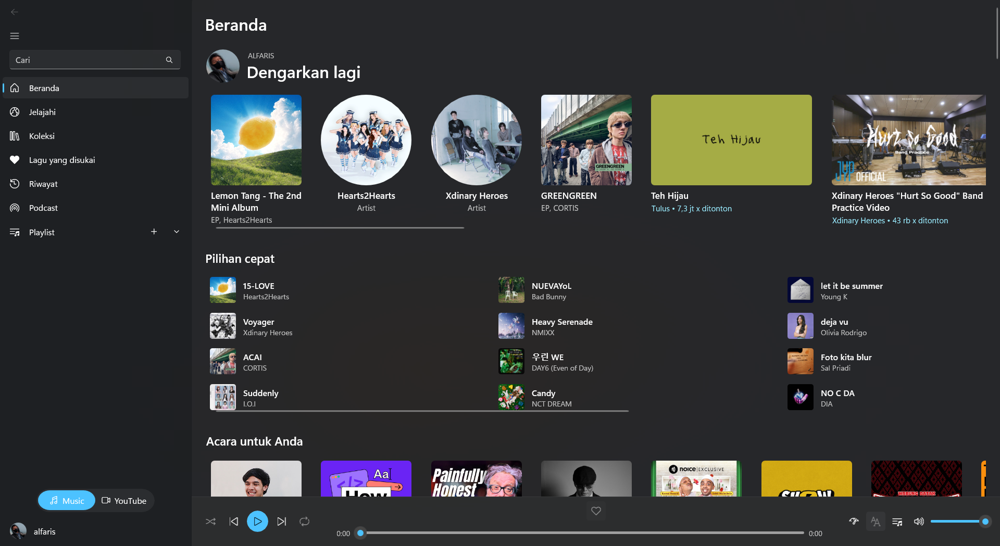
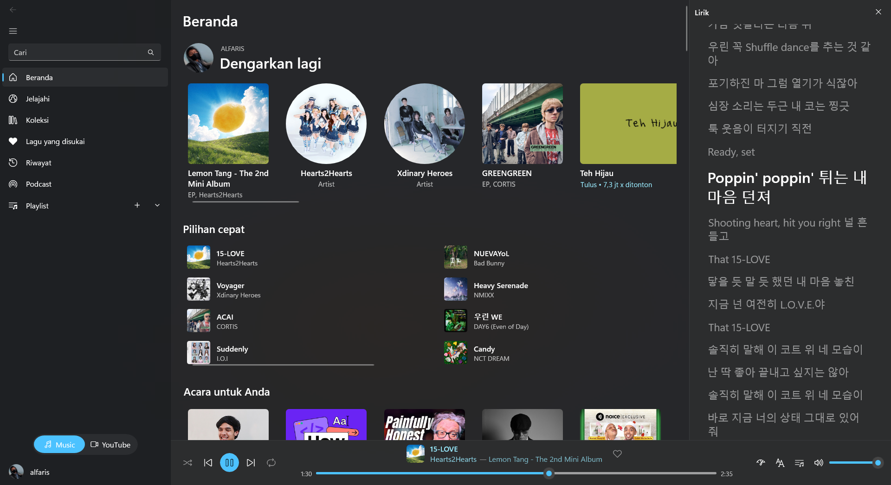

# Kaset for Windows (KasetWin)

A native **Windows** client for YouTube Music, built with **C# / .NET 8 + WinUI 3** (Windows App SDK). A ground-up Windows port of the macOS [Kaset](https://github.com/sozercan/kaset) app — the same idea (a clean, native music client for YouTube Music) with an Apple-Music-inspired design, rebuilt with Windows-native UI and platform integrations.

<table>
  <tr>
    <th>Home</th>
    <th>Now Playing + Lyrics</th>
  </tr>
  <tr>
    <td></td>
    <td></td>
  </tr>
</table>

> **Note:** the images above are placeholders — drop real screenshots into `docs/` (e.g. `docs/screenshot-home.png`, `docs/screenshot-nowplaying.png`).

## Features

- 🪟 **Native Windows 11 Experience** — WinUI 3 / Fluent design with a Mica backdrop, an Apple-Music-style player bar, a clean sidebar, and a Music ↔ YouTube source toggle
- 🎧 **YouTube Music Support** — Full playback of DRM-protected YouTube Music content via your existing Premium subscription (hosted in a hidden background WebView2)
- 🔊 **Background Audio** — Music keeps playing when the window is closed; stops on an explicit quit
- 🧭 **Explore** — New releases, charts (with rank and up/down trend arrows), and moods & genres
- 🎙️ **Podcasts** — Browse shows and creator channels, play episodes, and track per-episode progress and played state
- 📚 **Library** — Playlists, liked songs, uploads, followed artists, and saved albums; create, edit, and delete your own playlists, add songs to playlists, and set custom local playlist covers
- 🕓 **History** — Revisit recently played tracks
- 🔍 **Search** — Apple-Music-style results (top results, artists, albums, songs, music videos, playlists, podcasts, episodes) with rich suggestions and local search history
- 🎚️ **Now Playing Panel** — Apple-Music-style docked side panel for the play queue and synced lyrics
- 📜 **Lyrics** — Plain and synced lyrics with line-by-line highlighting; providers include LRCLib and NetEase (good Asian/K-pop coverage). Podcast episodes show YouTube captions (CC) as synced "lyrics" with optional word-by-word karaoke highlighting
- 📃 **Queue Management** — View, reorder, shuffle, and auto-refill (radio) the playback queue
- 🎛️ **Equalizer** — 9-band equalizer with presets, applied to the WebView2 playback output
- 🌗 **Light / Dark Mode** — Follow Windows, or force light or dark
- ⌨️ **Keyboard Shortcuts** — Full keyboard control (YouTube-Music-style scheme) for playback, seeking, volume, like/dislike, lyrics, and navigation — press **Shift + /** for the in-app cheat sheet
- 🖥️ **System Integration** — Windows Now Playing / media transport controls (SMTC), media-key support, taskbar thumbbar controls, and track-change notifications
- 📣 **Share** — Share songs, playlists, albums, and artists via the Windows share sheet
- 🔗 **URL Scheme** — Open songs directly with `kaset://play?v=VIDEO_ID`
- 🧩 **Extensions (Adblock)** — Loads unpacked browser extensions into the playback WebView2, with uBlock Origin auto-downloaded and kept up to date
- 🌍 **Localized** — Fully localized UI in **Indonesian** and **English** (chrome, menus, dialogs, and toasts follow the app language; YouTube Music content follows the same language pin)
- ▶️ **YouTube Mode** — *In progress.* The Music ↔ YouTube toggle and the scaffolding for a full YouTube surface (home / watch / subscriptions / shorts / history) exist, but this mode is **not yet complete**.

> Out of scope for the Windows port (macOS-only in the original): Apple Intelligence / on-device AI, haptics, AppleScript, and the macOS share sheet.

## Requirements

- Windows 10 version 1809 (build 17763) or later — Windows 11 recommended
- WebView2 Runtime (preinstalled on Windows 11)
- A [Google](https://accounts.google.com) account for YouTube Music personalization (a Premium subscription is required for full, ad-free playback)

## Installation

Download the latest release from the [Releases](https://github.com/alfarisauliarahman/kaset-win/releases) page.

- **`Kaset-win-Setup.exe`** — the installer. Double-click to install; it creates Desktop and Start-menu shortcuts and supports in-place updates.
- **`Kaset-win-Portable.zip`** — a no-install version. Extract anywhere and run `KasetWin.App.exe` directly.

> **Note:** the app is **not code-signed**, so Windows SmartScreen may warn on first run — choose *More info → Run anyway*. Your sign-in session and settings are stored per-user under `%LOCALAPPDATA%\Kaset`.

## Building from source

Requires the [.NET 8 SDK](https://dotnet.microsoft.com/download) and the Windows App SDK build tooling (restored via NuGet). For running a local packaged (MSIX) build, enable **Developer Mode** (Settings → Privacy & security → For developers).

```powershell
# Dev build (packaged / MSIX):
dotnet build src/KasetWin.App/KasetWin.App.csproj -c Debug

# Tests (headless core, no WinUI):
dotnet test tests/KasetWin.Core.Tests/KasetWin.Core.Tests.csproj

# Standalone .exe (unpackaged, self-contained):
dotnet publish src/KasetWin.App/KasetWin.App.csproj -c Release -r win-x64 --self-contained true `
  -p:Platform=x64 -p:WindowsPackageType=None -p:WindowsAppSDKSelfContained=true

# Installer + auto-update feed (requires: dotnet tool install -g vpk):
vpk pack --packId Kaset --packVersion 0.2.0 --mainExe KasetWin.App.exe --packTitle "Kaset" `
  --packDir src/KasetWin.App/bin/x64/Release/net8.0-windows10.0.19041.0/win-x64/publish --outputDir dist
```

> Tip: if a parallel build hits an XamlCompiler file lock, run `dotnet build-server shutdown` and add `-p:UseSharedCompilation=false`.

## Project layout

| Project | Role |
|---------|------|
| `KasetWin.Core` | Headless domain core — models, InnerTube client + parsers, queue / player / auth logic, lyrics, settings. No WinUI dependency; unit- and property-tested. |
| `KasetWin.Platform` | WinRT adapters — WebView2 playback controller, SMTC, DPAPI credentials, image decode/cache, network monitor, cross-mode storage (`AppData`). |
| `KasetWin.App` | WinUI 3 app — pages, ViewModels (MVVM), DI / Generic Host bootstrap, the hidden playback WebView2 host, keyboard shortcuts, localization. |
| `KasetWin.ApiExplorer` | Console tool to explore InnerTube endpoints. |
| `tests/KasetWin.Core.Tests` | xUnit + **CsCheck** property-based tests over the headless core. |

## Security

Never commit real cookies, tokens, `SAPISID` / `__Secure-3PAPISID` values, or any credentials. Test fixtures use sanitized placeholders only. Secrets at runtime are stored via DPAPI / the Windows Credential Locker, never in the repo.

## Credits

Based on [Kaset](https://github.com/sozercan/kaset) by Sertaç Özercan. This Windows port is an independent reimplementation in C# / WinUI 3.

## Disclaimer

KasetWin is an unofficial application and is not affiliated with YouTube or Google Inc. in any way. "YouTube", "YouTube Music", and the "YouTube Logo" are registered trademarks of Google Inc.
